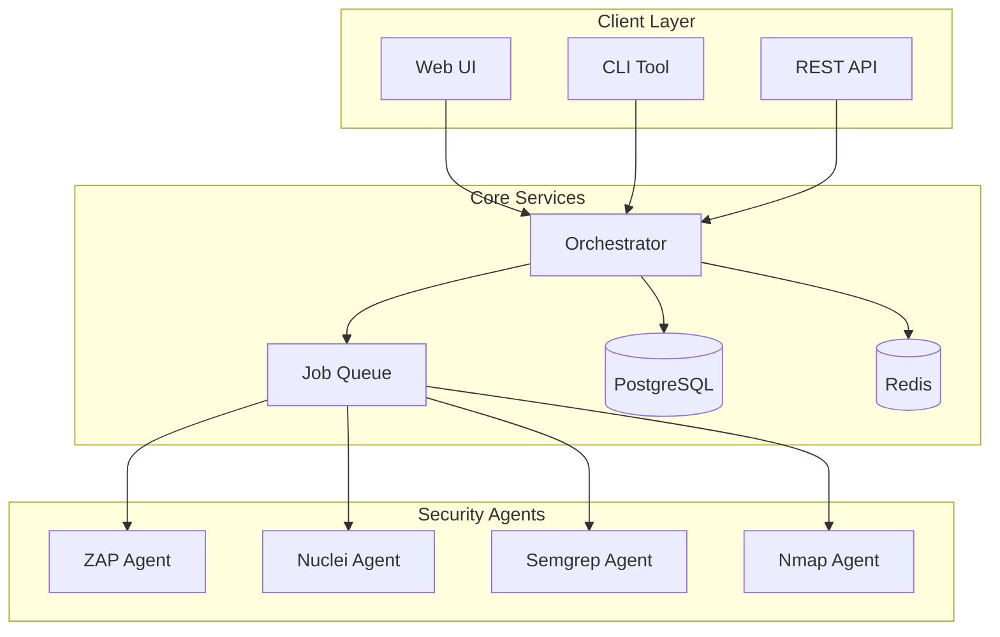

# AI-Testing Platform

Modern, distributed security testing orchestration platform with AI-powered test planning and multi-agent architecture.

## 🚀 Features

- **Distributed Testing**: Multiple specialized security testing agents
- **AI Planning**: Intelligent test plan generation with OpenAI/Anthropic
- **Comprehensive Coverage**: Web, API, mobile, network, and code testing
- **Enterprise Ready**: Multi-tenancy, RBAC, audit logging
- **Real-time Monitoring**: Live execution tracking via SSE/WebSocket

## 📋 Requirements

- Docker & Docker Compose v2
- Python 3.9+ 
- 8GB RAM minimum
- Linux/macOS (Windows WSL2 supported)

## ⚡ Quick Start

### 1. Clone Repository
```bash
git clone https://github.com/yered1/AI-testing.git
cd AI-testing
```

### 2. Configure Environment
```bash
cp .env.example .env
# Edit .env and set:
# - SECRET_KEY (use: openssl rand -hex 32)
# - DB_PASSWORD (strong password)
# - AI keys (optional)
```

### 3. Start Platform
```bash
# Start all services
./scripts/manage.sh full-start

# Verify health
./scripts/manage.sh status
```

### 4. Access Services
- **API**: http://localhost:8080
- **API Docs**: http://localhost:8080/docs
- **Health**: http://localhost:8080/health

## 🧪 Run Your First Test

### Using API
```bash
# 1. Create engagement
ENGAGEMENT_ID=$(curl -s -X POST http://localhost:8080/api/v2/engagements \
  -H "Content-Type: application/json" \
  -H "X-Tenant-Id: default" \
  -d '{
    "name": "Test Scan",
    "type": "web_application", 
    "scope": {
      "targets": ["http://testphp.vulnweb.com"],
      "exclude": []
    }
  }' | jq -r .id)

# 2. Create test plan
PLAN_ID=$(curl -s -X POST http://localhost:8080/api/v2/engagements/$ENGAGEMENT_ID/plans \
  -H "Content-Type: application/json" \
  -H "X-Tenant-Id: default" \
  -d '{
    "name": "Basic Web Scan",
    "tests": ["web_discovery", "web_vulnerabilities"]
  }' | jq -r .id)

# 3. Execute plan
RUN_ID=$(curl -s -X POST http://localhost:8080/api/v2/plans/$PLAN_ID/runs \
  -H "Content-Type: application/json" \
  -H "X-Tenant-Id: default" \
  -d '{}' | jq -r .id)

# 4. Check status
curl -s http://localhost:8080/api/v2/runs/$RUN_ID | jq .status
```

### Using Python Client
```python
from ai_testing_client import AITestingClient

client = AITestingClient("http://localhost:8080")

# Create and run test
engagement = client.create_engagement(
    name="API Security Test",
    type="api",
    targets=["https://api.example.com"]
)

plan = client.create_plan(
    engagement_id=engagement.id,
    tests=["api_fuzzing", "auth_bypass"]
)

run = client.execute_plan(plan.id)
print(f"Test running: {run.id}")

# Monitor progress
for event in client.stream_events(run.id):
    print(f"{event.type}: {event.message}")
```

## 🤖 Security Testing Agents

| Agent | Purpose | Capabilities |
|-------|---------|-------------|
| **ZAP** | Web Application Security | OWASP Top 10, Ajax crawling, Active/Passive scanning |
| **Nuclei** | Vulnerability Detection | CVE detection, Custom templates, Fast scanning |
| **Semgrep** | Static Code Analysis | SAST, Secret detection, Custom rules |
| **Nmap** | Network Discovery | Port scanning, Service detection, OS fingerprinting |
| **SQLMap** | SQL Injection | Database enumeration, Data extraction, WAF bypass |
| **Mobile** | Mobile App Testing | APK/IPA analysis, API testing, Certificate pinning |

## 🛠 Management Commands

```bash
# Service Control
./scripts/manage.sh up              # Start services
./scripts/manage.sh down            # Stop services
./scripts/manage.sh restart         # Restart all
./scripts/manage.sh status          # Check health
./scripts/manage.sh logs [service]  # View logs

# Database
./scripts/manage.sh migrate         # Run migrations
./scripts/manage.sh db-shell        # PostgreSQL CLI
./scripts/manage.sh db-backup       # Create backup

# Testing
./scripts/manage.sh test            # Run test suite
./scripts/manage.sh test-api        # API smoke test

# Agents
./scripts/manage.sh agent-token [name]  # Generate token
./scripts/manage.sh agents-start        # Start all agents
./scripts/manage.sh agent-status        # Check agents

# Development
./scripts/manage.sh shell           # Python shell
./scripts/manage.sh clean           # Clean temp files
```

## 📊 Architecture



## 🔧 Configuration

### Environment Variables
Key configuration in `.env`:
```bash
# Security
SECRET_KEY=<random-32-char-hex>
ALLOW_ACTIVE_SCAN=false  # Never true without authorization

# Database
DB_PASSWORD=<strong-password>

# AI Providers (optional)
OPENAI_API_KEY=sk-...
ANTHROPIC_API_KEY=sk-ant-...

# Features
ENABLE_AI_PLANNING=true
ENABLE_AUTO_REMEDIATION=false
```

### Docker Profiles
```bash
# Default: Core services only
docker compose up

# Full: All services including agents
docker compose --profile full up

# Dev: Development mode with hot reload
docker compose --profile dev up
```

## 📚 API Documentation

Interactive API docs available at http://localhost:8080/docs

### Key Endpoints
- `POST /api/v2/engagements` - Create test engagement
- `GET /api/v2/engagements/{id}` - Get engagement details
- `POST /api/v2/plans` - Create test plan
- `POST /api/v2/runs` - Execute test
- `GET /api/v2/runs/{id}/results` - Get results
- `GET /api/v2/reports/{id}` - Generate report

## 🔒 Security Considerations

- **Authentication**: JWT tokens with refresh mechanism
- **Authorization**: Role-based access control (Admin, User, Viewer)
- **Data Protection**: Encryption at rest and in transit
- **Audit Logging**: All actions logged with user attribution
- **Input Validation**: Strict validation on all inputs
- **Rate Limiting**: API rate limits per user/tenant

⚠️ **Important**: 
- Never enable `ALLOW_ACTIVE_SCAN` without written authorization
- Rotate secrets and tokens regularly
- Use TLS in production
- Implement network segmentation

## 🐛 Troubleshooting

### Common Issues

**Services won't start**
```bash
# Check Docker
docker version
docker compose version

# Check ports
sudo lsof -i :8080  # API
sudo lsof -i :5432  # PostgreSQL
sudo lsof -i :6379  # Redis

# Reset if needed
./scripts/manage.sh full-reset
```

**Database connection errors**
```bash
# Check PostgreSQL
./scripts/manage.sh db-shell
\l  # List databases
\q  # Quit

# Recreate database
./scripts/manage.sh down -v
./scripts/manage.sh full-start
```

**Agent connection issues**
```bash
# Check agent status
./scripts/manage.sh agent-status

# View agent logs
docker logs ai_testing_zap_agent

# Regenerate token
./scripts/manage.sh agent-token zap
```

## 🚀 Production Deployment

### Using Docker Swarm
```bash
docker swarm init
docker stack deploy -c docker-compose.prod.yml ai_testing
```

### Using Kubernetes
```bash
kubectl create namespace ai-testing
kubectl apply -f k8s/
```

### Cloud Providers
- **AWS**: ECS with Fargate or EKS
- **GCP**: Cloud Run or GKE  
- **Azure**: Container Instances or AKS

## 🤝 Contributing

We welcome contributions! See [CONTRIBUTING.md](CONTRIBUTING.md)

1. Fork the repository
2. Create feature branch
3. Commit changes
4. Push to branch
5. Open pull request

## 📄 License

MIT License - See [LICENSE](LICENSE)

## 📞 Support

- **Issues**: [GitHub Issues](https://github.com/yered1/AI-testing/issues)
- **Discussions**: [GitHub Discussions](https://github.com/yered1/AI-testing/discussions)
- **Security**: Report vulnerabilities to security@ai-testing.io

---

Built with ❤️ by the security community