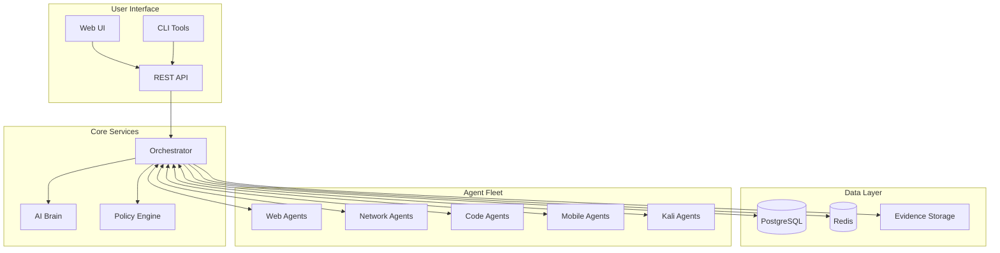

# AI-Testing Platform Architecture

## System Overview



## Directory Structure

```
ai-testing/
├── orchestrator/           # Core orchestration service
│   ├── api/               # API endpoints
│   │   ├── v2/           # Current API version
│   │   └── v3/           # Brain API endpoints
│   ├── models/           # Database models
│   ├── services/         # Business logic
│   ├── agent_sdk/        # Agent SDK library
│   ├── alembic/          # Database migrations
│   └── config.py         # Configuration management
│
├── agents/                # Testing agents
│   ├── base/             # Base agent class
│   ├── web/              # Web testing agents
│   │   ├── zap/
│   │   └── nuclei/
│   ├── network/          # Network scanning agents
│   │   └── nmap/
│   ├── code/             # Code analysis agents
│   │   └── semgrep/
│   ├── mobile/           # Mobile testing agents
│   │   └── apk/
│   └── kali/             # Kali Linux agents
│       ├── remote/
│       └── os/
│
├── ui/                    # Web interface
│   ├── src/
│   ├── public/
│   └── package.json
│
├── infra/                 # Infrastructure
│   ├── docker/           # Docker configurations
│   ├── k8s/              # Kubernetes manifests
│   └── terraform/        # IaC definitions
│
├── policies/              # OPA policies
│   └── rbac.rego
│
├── tests/                 # Test suites
│   ├── unit/
│   ├── integration/
│   └── e2e/
│
├── scripts/              # Utility scripts
│   ├── setup/
│   ├── maintenance/
│   └── deployment/
│
└── docs/                 # Documentation
    ├── api/
    ├── agents/
    └── deployment/
```

## Component Details

### Orchestrator
- **Purpose**: Central coordination of security testing workflows
- **Technologies**: Python, FastAPI, SQLAlchemy
- **Responsibilities**:
  - Job scheduling and distribution
  - Agent management
  - Result aggregation
  - Report generation

### Agents
- **Purpose**: Execute security testing tools
- **Technologies**: Python, Docker
- **Types**:
  - Web Application (ZAP, Nuclei)
  - Network (Nmap, Masscan)
  - Code Analysis (Semgrep, Bandit)
  - Mobile (APK Analyzer)
  - Kali Tools (Metasploit, etc.)

### AI Brain
- **Purpose**: Intelligent test planning and analysis
- **Technologies**: Python, LangChain
- **Capabilities**:
  - Automated test plan generation
  - Risk assessment
  - Finding enrichment
  - Report summarization

### Policy Engine (OPA)
- **Purpose**: Enforce security policies and RBAC
- **Technologies**: Open Policy Agent, Rego
- **Policies**:
  - Access control
  - Resource limits
  - Scan authorization

## Data Flow

1. **Engagement Creation**
   - User defines scope and objectives
   - System validates against policies

2. **Plan Generation**
   - AI Brain analyzes requirements
   - Generates optimized test plan
   - User reviews and approves

3. **Test Execution**
   - Orchestrator distributes jobs to agents
   - Agents execute tests and report results
   - Real-time status via SSE/WebSocket

4. **Result Processing**
   - Findings aggregated and deduplicated
   - AI enrichment adds context
   - Evidence stored securely

5. **Report Generation**
   - Multiple formats (HTML, PDF, JSON)
   - Customizable templates
   - Compliance mapping

## Security Model

### Authentication
- API Keys for service-to-service
- OAuth2/OIDC for user authentication
- JWT tokens for session management

### Authorization
- Role-based access control (RBAC)
- Tenant isolation
- Resource-level permissions

### Data Protection
- Encryption at rest and in transit
- Secure artifact storage
- Audit logging

## Deployment Options

### Docker Compose (Development)
```bash
docker compose --profile full up
```

### Kubernetes (Production)
```bash
kubectl apply -f infra/k8s/
```

### Cloud Native
- AWS ECS/EKS
- Google Cloud Run/GKE
- Azure Container Instances/AKS

## Monitoring & Observability

### Metrics
- Prometheus metrics endpoint
- Custom business metrics
- Agent health monitoring

### Logging
- Structured JSON logging
- Centralized log aggregation
- Error tracking with Sentry

### Tracing
- OpenTelemetry support
- Distributed tracing
- Performance profiling

## Scaling Considerations

### Horizontal Scaling
- Stateless orchestrator instances
- Agent auto-scaling based on queue depth
- Database read replicas

### Performance Optimization
- Redis caching layer
- Async job processing
- Batch operations

### Resource Management
- Job priority queues
- Rate limiting
- Resource quotas per tenant
